# 测试文档

## 测试环境

| 项目 | 内容 |
|------|------|
| 操作系统 | Windows 11 |
| Python 版本 | 3.x |
| 浏览器 | Chrome / Edge |
| 测试时间 | 2026-03-04 |
| 测试地址 | http://localhost:5000 |

---

## 测试用例总览

| 编号 | 测试项 | 测试类型 | 预期结果 |
|------|--------|----------|----------|
| TC-01 | 项目启动 | 环境测试 | 服务正常启动，数据库初始化完成 |
| TC-02 | 首页商品展示 | 功能测试 | 展示 9 件商品卡片 |
| TC-03 | 商品详情页 | 功能测试 | 显示商品完整信息和评论区 |
| TC-04 | 用户注册（成功） | 功能测试 | 注册成功并跳转登录页 |
| TC-05 | 用户注册（重复用户名） | 异常测试 | 提示"用户名已存在" |
| TC-06 | 用户登录（成功） | 功能测试 | 登录成功并显示用户名 |
| TC-07 | 用户登录（错误密码） | 异常测试 | 提示"用户名或密码错误" |
| TC-08 | 未登录发表评论 | 权限测试 | 按钮变为"登录后评论" |
| TC-09 | 已登录发表评论 | 功能测试 | 评论成功出现在列表中 |
| TC-10 | 用户注销 | 功能测试 | 退出登录，导航栏恢复未登录状态 |

---

## TC-01：项目启动

**目的**：验证项目能正常启动，数据库和初始数据自动创建。

**步骤**：

1. 打开终端，进入项目目录：
   ```bash
   cd d:/Code/flaskOnlineShop
   ```
2. 执行启动命令：
   ```bash
   python run.py
   ```
3. 观察终端输出

**预期结果**：
- 终端打印 `初始化测试商品数据完成，共 9 件。`
- 终端打印 `Running on http://127.0.0.1:5000`
- `instance/shop.db` 文件被创建

**实际结果**：✅ 通过 　□ 失败

**终端截图**：

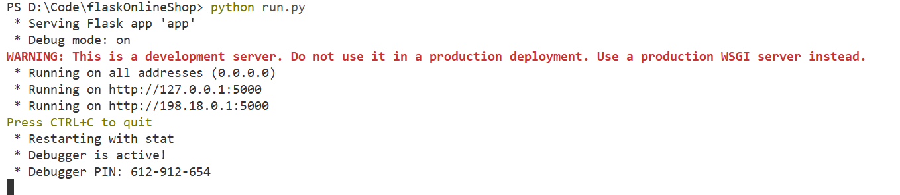

---

## TC-02：首页商品展示

**目的**：验证首页能正确展示所有商品卡片。

**步骤**：

1. 打开浏览器，访问 `http://localhost:5000`
2. 观察页面内容

**预期结果**：
- 页面标题显示"热门商品"
- 展示 9 张商品卡片，每张包含：图片、名称、价格、"查看详情"按钮
- 导航栏右侧显示"登录"和"注册"（未登录状态）

**实际结果**：✅ 通过 　□ 失败

**页面截图**：

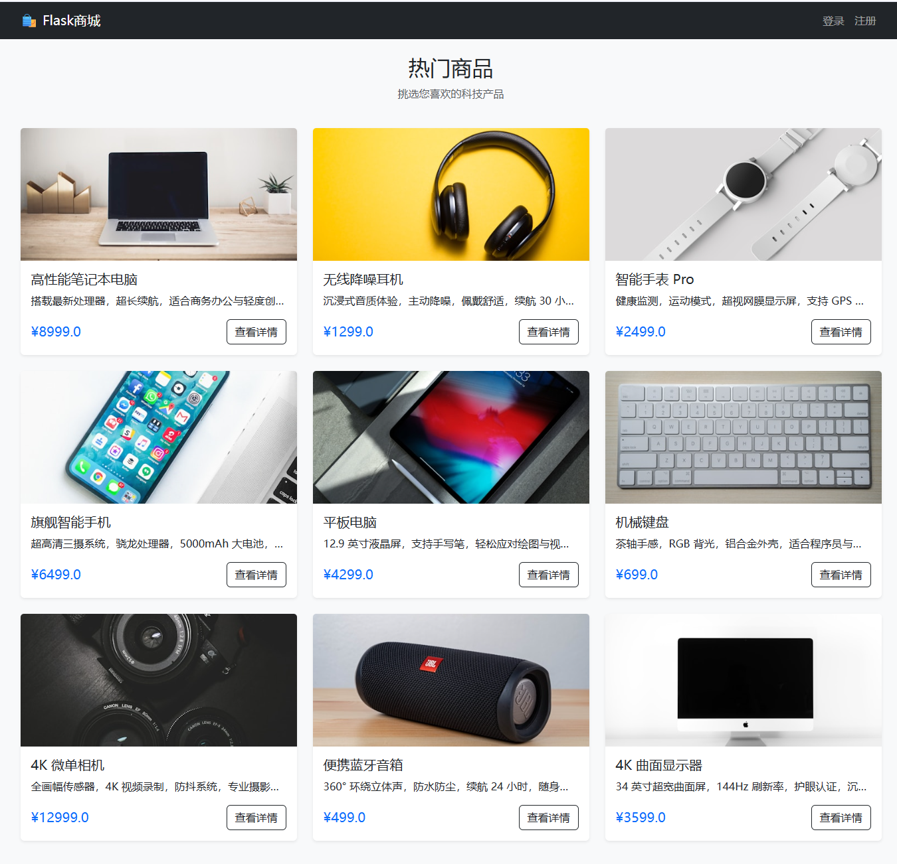

---

## TC-03：商品详情页

**目的**：验证商品详情页能正确显示商品信息和评论区。

**步骤**：

1. 在首页点击任意商品的**查看详情**按钮
2. 观察详情页内容

**预期结果**：
- 显示商品大图、名称、价格、描述
- 页面下方有"用户评价"区域，新商品显示"暂无评论，快来抢沙发吧！"
- 评论输入框下方显示**登录后评论**按钮（未登录状态）

**实际结果**：✅ 通过 　□ 失败

**页面截图**：

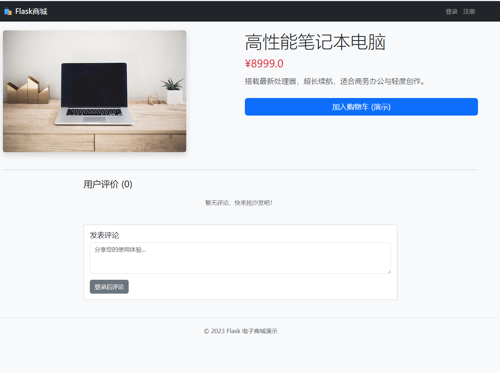

---

## TC-04：用户注册（成功）

**目的**：验证新用户能成功注册。

**步骤**：

1. 点击导航栏**注册**
2. 填写用户名：`testuser`，密码：`123456`
3. 点击**注册**按钮
4. 观察页面跳转和提示信息

**预期结果**：
- 页面跳转到登录页
- 顶部显示绿色提示"注册成功，请登录"

**实际结果**：✅ 通过 　□ 失败

**步骤截图**：

**① 填写注册表单**

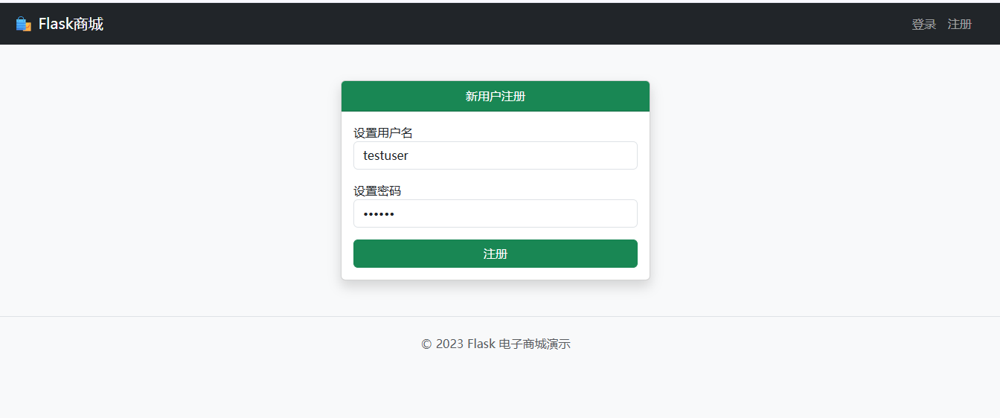

**② 注册成功提示**

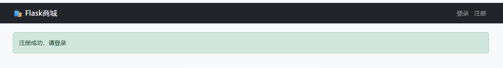

---

## TC-05：用户注册（重复用户名）

**目的**：验证注册时使用已存在用户名会给出正确提示。

**步骤**：

1. 点击导航栏**注册**
2. 填写用户名：`testuser`（与 TC-04 相同的用户名），密码：任意
3. 点击**注册**按钮
4. 观察提示信息

**预期结果**：
- 页面留在注册页
- 顶部显示红色提示"用户名已存在"
- 未创建新用户

**实际结果**：✅ 通过 　□ 失败

**提示截图**：

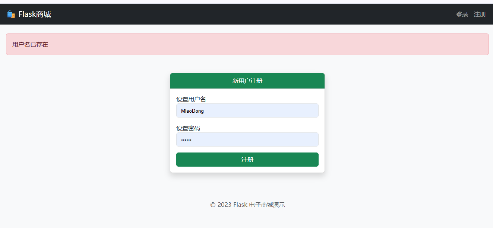

---

## TC-06：用户登录（成功）

**目的**：验证已注册用户能成功登录。

**步骤**：

1. 点击导航栏**登录**
2. 填写用户名：`testuser`，密码：`123456`
3. 点击**登录**按钮
4. 观察页面变化

**预期结果**：
- 页面跳转到首页
- 顶部显示绿色提示"登录成功"
- 导航栏右侧变为"你好, testuser　注销"

**实际结果**：✅ 通过 　□ 失败

**步骤截图**：

**① 填写登录表单**

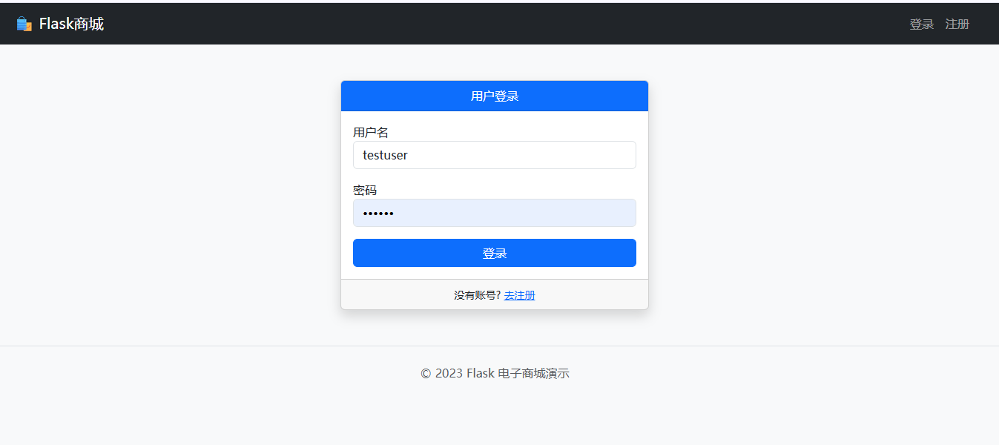

**② 登录成功状态**


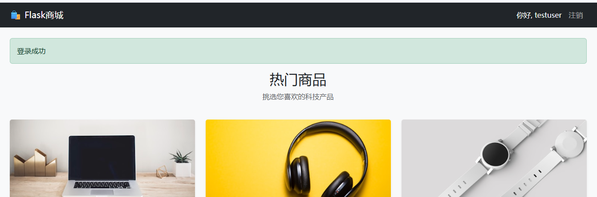

---

## TC-07：用户登录（错误密码）

**目的**：验证输入错误密码时给出正确提示。

**步骤**：

1. 点击导航栏**登录**
2. 填写用户名：`testuser`，密码：`wrongpassword`
3. 点击**登录**按钮
4. 观察提示信息

**预期结果**：
- 页面留在登录页
- 顶部显示红色提示"用户名或密码错误"
- 未进入登录状态

**实际结果**：✅ 通过 　□ 失败

**提示截图**：


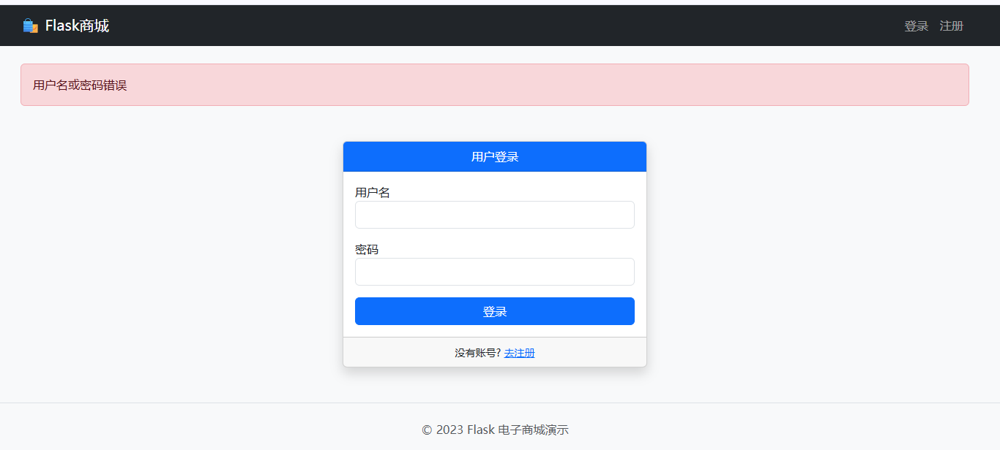

---

## TC-08：未登录状态下发表评论

**目的**：验证未登录用户无法提交评论，评论入口正确引导登录。

**步骤**：

1. 确保当前为未登录状态（或先注销）
2. 进入任意商品详情页
3. 观察评论区底部按钮

**预期结果**：
- 评论输入框可以填写（无法阻止用户填写输入框）
- 提交按钮显示为灰色**登录后评论**，点击后跳转到登录页

**实际结果**：✅ 通过 　□ 失败

**页面截图**：

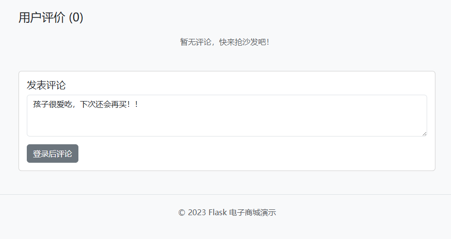

---

## TC-09：已登录状态下发表评论

**目的**：验证已登录用户可以成功发表评论。

**前置条件**：已使用 `testuser` 登录（参考 TC-06）

**步骤**：

1. 进入任意商品详情页
2. 在评论输入框中输入：`这款产品非常好用，强烈推荐！`
3. 点击**提交评论**按钮
4. 观察页面变化

**预期结果**：
- 页面刷新停留在当前商品详情页
- 顶部显示绿色提示"评论发表成功！"
- 评论列表中出现刚发表的内容，显示用户名 `testuser` 和当前时间

**实际结果**：✅ 通过 　□ 失败

**步骤截图**：

**① 填写评论内容**

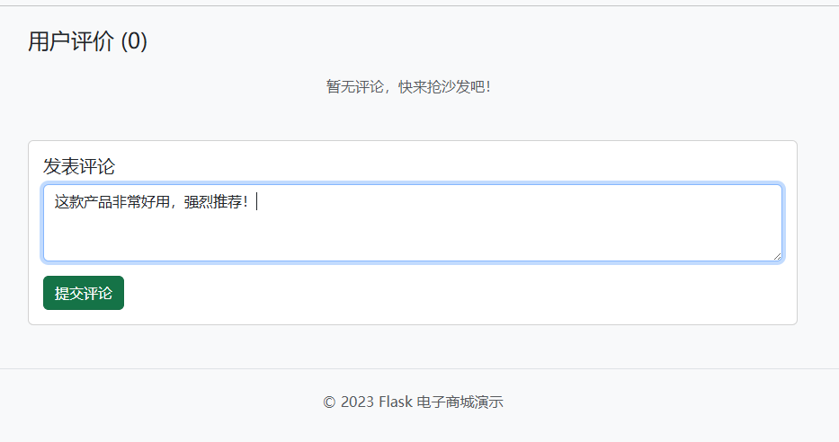

**② 评论提交成功**

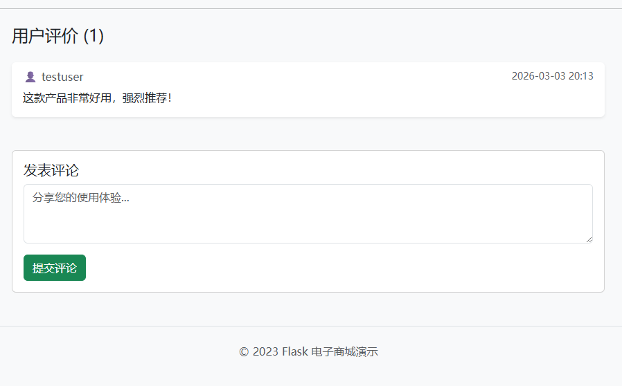

---

## TC-10：用户注销

**目的**：验证注销功能能正确清除登录状态。

**前置条件**：已登录状态

**步骤**：

1. 点击导航栏右侧**注销**
2. 观察页面变化

**预期结果**：
- 页面跳转到首页
- 顶部显示蓝色提示"您已退出登录"
- 导航栏右侧恢复"登录　注册"

**实际结果**：✅ 通过 　□ 失败

**页面截图**：

<!-- 截图内容：首页，顶部蓝色"您已退出登录"提示，导航栏显示"登录 注册" -->

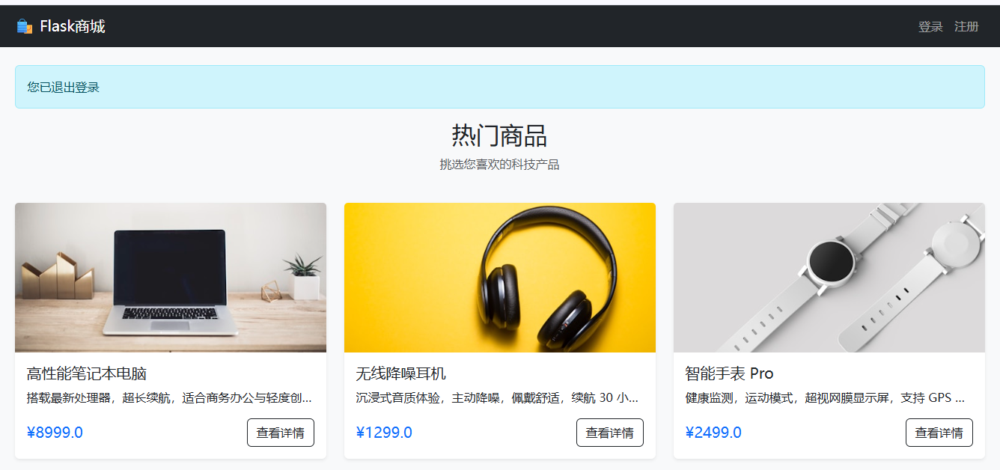

---

## 测试结果汇总

| 编号 | 测试项 | 结果 | 备注 |
|------|--------|------|------|
| TC-01 | 项目启动 | ✅ 通过 □ 失败 | |
| TC-02 | 首页商品展示 | ✅ 通过 □ 失败 | |
| TC-03 | 商品详情页 | ✅ 通过 □ 失败 | |
| TC-04 | 用户注册（成功） | ✅ 通过 □ 失败 | |
| TC-05 | 用户注册（重复用户名） | ✅ 通过 □ 失败 | |
| TC-06 | 用户登录（成功） | ✅ 通过 □ 失败 | |
| TC-07 | 用户登录（错误密码） | ✅ 通过 □ 失败 | |
| TC-08 | 未登录发表评论 | ✅ 通过 □ 失败 | |
| TC-09 | 已登录发表评论 | ✅ 通过 □ 失败 | |
| TC-10 | 用户注销 | ✅ 通过 □ 失败 | |
| **合计** | | **10通过** | |
